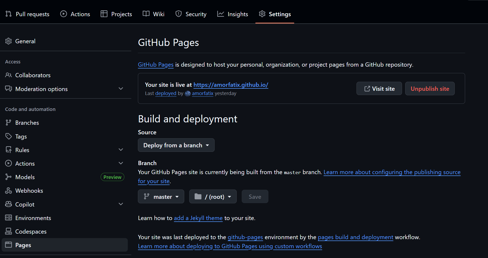
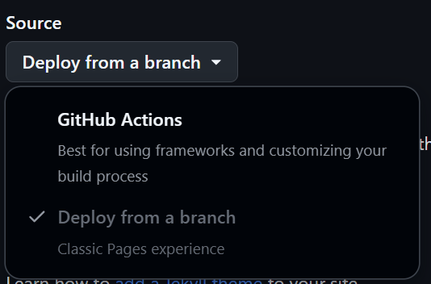

+++
date = '2025-11-21T22:21:18+08:00'
draft = false
title = 'Hello World'

+++
这个博客诞生于本人和女友闹矛盾后！！！闹矛盾之后还要汇报，实在是太惨了。

写本周进度时才发现前端学习停滞了许久，我跟AI讨论现在这个时代学习前端的意义是什么，现在AI能轻易的写出更规范的能跑的代码，我还需要学吗，讨论出的结论是目前前端学习应该侧重设计模式、数据流、性能优化和系统架构。不过我以后大概率不会做前端，只是需要具备这项能力。

该博客创建全程在gemini的指导下。gemini推荐博客分成两个仓库:源码仓库和发布仓库，这样便于管理。

### 安装hugo和主题

```bash
choco install hugo -confirm  # windows cmd 管理员权限运行
hugo new site my-hugo-blog
cd my-hugo-blog
# 进入主题文件夹
git init
git submodule add https://github.com/adityatelange/hugo-PaperMod.git themes/PaperMod
```

### 配置文件

这是我最终的配置文件

```toml
baseURL = 'https://amorfatix.github.io/'
languageCode = 'en-us'
title = 'AmorFatIX'
theme='PaperMod'
[params]
  homeInfoPaginate = 5
  ShowReadingTime = true
  ShowPostNavLinks = true
  ShowBreadCrumbs = true
  ShowCodeCopyButtons = true
  assets_disable_fingerprinting = true
  [params.homeInfoParams]
    Title = "你好，我是AmorFatIX"
    Content = "我告诉自己的灵魂说，别作声，耐心等待。"
  [[params.socialIcons]]
  name = "GitHub" # 将 <platform> 替换为实际名称
  url = "https://github.com/amorfatix" # 将 <link> 替换为实际链接
[[menu.main]]
  identifier = "archives"
  name = "archives"
  url = "archives/"
  weight = 20
```

##### public仓库 部署到github pages

`setting->pages`



有2种选择



- `github action`  偏工程化 在hugo源码仓库上部署，部署后每次仓库推送更新，它会自动在云端构建生成静态文件并推送到Pages 服务所需的部署目标，自动化，但配置文件比较复杂，难写
- `deploy from a branch` 在public(在本地编译好的静态文件目录)上部署，GitHub Pages 服务简单地**读取**该分支上的文件，并将其作为网站发布，比较简单

刚开始搞，我选的是`deploy from a branch` 。gemini写了一个`deploy.sh`脚本自动构建并推送，也挺方便的。

```bash
#!/bin/bash
echo "清除旧的 public 目录..."
rm -rf public
echo "开始生成 Hugo 静态站点..."
# 生成静态文件到 public 目录
hugo -D
echo "进入 public 目录并进行部署..."
cd public
# 初始化 public 目录为新的 Git 仓库
git init
git add .
git commit -m "Publish $(date)"
# 替换成您的 Pages 仓库地址
REMOTE_URL="git@github.com:amorfatix/amorfatix.github.io.git" 
# 推送到 Pages 仓库的 master 分支
git push -f $REMOTE_URL master
echo "部署完成!"
cd ..
```

*个人理解，配置github action实现的就是这个脚本的功能，如果我在hugo源码仓库配置了github action，那么我git push hugo源码后，github action会在云端执行以上操作。而我执行这个脚本就是在本地执行了这些操作。这两种大差不差，有机会我会试试github action的*

### 问题 资源完整性检查总是失败

`PaperMod`的一个特点就是支持[SRI](https://developer.mozilla.org/en-US/docs/Web/Security/Subresource_Integrity)，博客本地测试是正常渲染的，但是部署到github pages总是

```javascript
failed to find a valid digest in the 'integrity' attribute for resource 'https://amorfatix.github.io/assets/css/stylesheet.fd5566c526ae48aadabd950798a2dc3568536401560eae5caac3765a42a9e7b5.css' with computed SHA-256 integrity 'NDzEgLn/yPBMy+XpaK1nSIDKt3PsGZBekwMwZcHnqAQ='. The resource has been blocked.
```

我猜测是css文件push到github之后它可能更换了换行，导致计算出的哈希值不一样。怎样避免呢？可以在.gitattributes里设置css为二进制，github就会跳过检测，没具体测试，因为public文件夹每次更新都会删除重新生成，脚本再加两句，生成一个.gitattributes也行，但我没试。

> **Windows：** 使用 CRLF (Carriage Return + Line Feed) 换行，即 `\r\n`。
>
> **Linux/macOS：** 使用 LF (Line Feed) 换行，即 `\n`。

我和AI都没找到关闭SRI的方式，在配置文件里试了好几个都不行。最后手动改了一下css，删除`integrity`属性，覆盖原格式。

```bash
mkdir -p layouts/partials
cp ./themes/PaperMod/layouts/partials/head.html  ./layouts/partials/
# 打开head.html 搜索integrity 删除所有integrity
#重新deploy，浏览器强制刷新即可
```
